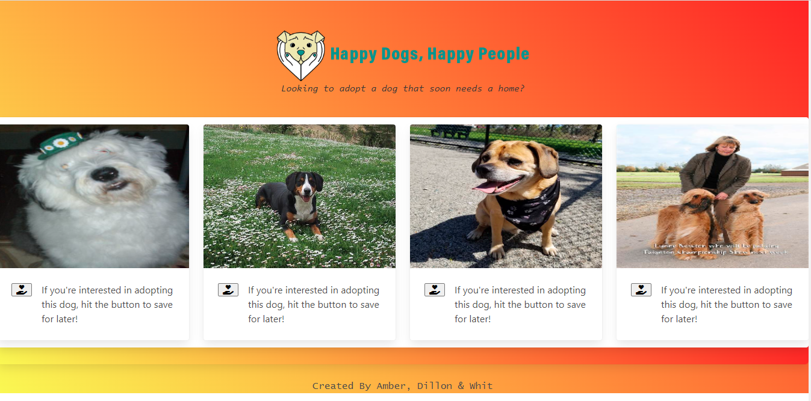

# GroupProj 

## Description

In this project, Whit, Dillon, and Amber collaborated to create a website where you can "like" a dog that will be put up for an adoption. We used a dog fact web API and a random dog picture for the user to "like". For this project we used JavaScript for functionality and CSS and Bulma for our styling.

## Installation

Here is the link to the deployed application:
https://dmagzzz.github.io/GroupProj/

Here is the link to the repository:
https://github.com/Dmagzzz/GroupProj

## Credits

Thanks, per usual, to the Calendy tutors, our TA, and our instructor, but mostly to our team for extra efforts in and out of class.

## License

Please refer to the licence in the repo.

## How to Contribute

Please let us know if there are any changes that could be made to improve the site. We can be reached at: astandish12@hotmail.com, hddod15@gmail.com, whitspa64@gmail.com

## Usage

A screen shot of the deployed application is below

